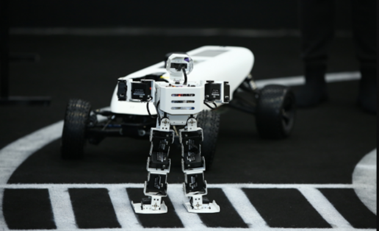

米娜桑大家好，我目前就读于 [北京理工大学](https://english.bit.edu.cn/)，是一名二年级的直博生（2022届）。在此之前, 我在北京理工大学 ([徐特立学院](https://xuteli.bit.edu.cn/)) 完成了本科学业（2018届）。曾担任北京理工大学人工智能俱乐部主任（2021年~2022年），获百度飞桨“开源新星奖”（5人/年），曾获北京理工大学 2024 年度“科研创新榜样”（5人/年）。我致力于人工智能开源社区建设。我目前的研究方向包括：零样本学习、3D 视觉和图形学，目前专注于 AI4Science（材料科学）。

最新进展
======
- [2024.03] 一篇论文被 ECCV'24 接收。

- [2024.03] 一篇论文被 CVPR'24 接收。

- [2023.12] 一篇论文发布在 Arxiv 上。

- [2023.09] 一篇论文被 ICCV'23 接收。

Github
======

[https://github.com/Sharpiless](https://github.com/Sharpiless)

<b>
    <image src="https://github-readme-stats.vercel.app/api?username=sharpiless&show_icons=true&theme=tokyonight" width=400>
    </image>
</b>

教育经历
------

  <b>北京理工大学</b>  
  2022.9 -    
  博士生，就读于 <a href="https://cs.bit.edu.cn/">计算机科学院</a> 

  

 

  <b>北京理工大学</b>  
  2018.9 - 2022.6  
  本科生，就读于 <a href="https://xuteli.bit.edu.cn/">徐特立学院</a> 

  

预印本
------

  

  

  

    
      <b>CascadeV-Det: Cascade Point Voting for 3D Object Detection</b>
       
     
    
      <b>Yingping Liang</b>, 
      <a href="https://ying-fu.github.io/">Ying Fu</a>
       
     
    
      Arxiv Preprint, 2024.01 
       
     
    
      <a href="https://arxiv.org/abs/2401.07477">[paper]</a> / 
      <a href="https://github.com/Sharpiless/CascadeV-Det">[project]</a> /
      <a href="https://github.com/Sharpiless/CascadeV-Det">[code]</a>
    
  

 

发表论文
------

  

  

  

    
      <b>Camera-LiDAR Cross-modality Gait Recognition</b>
       
     
    
      Wenxuan Guo* (Tsinghua University),
      <b>Yingping Liang*</b>,
      Zhiyu Pan,
      Ziheng Xi, 
      Jianjiang Feng,
      Jie Zhou
       
     
    
      European Conference on Computer Vision 2024 (<b>ECCV</b>), 2024
       
     
    
      <a>[paper]</a> / 
      <a>[project]</a> /
      <a>[code]</a>
    
  

 

  

  

  

    
      <b>LiDAR-based Person Re-identification</b>
       
     
    
      Wenxuan Guo (Tsinghua University),
      Zhiyu Pan, 
      <b>Yingping Liang</b>, 
      Ziheng Xi,
      Zhichen Zhong,
      Jianjiang Feng,
      Jie Zhou
       
     
    
      The IEEE/CVF Conference on Computer Vision and Pattern Recognition (<b>CVPR</b>), 2024 
       
     
    
      <a href="https://arxiv.org/abs/2312.03033">[paper]</a> / 
      <a href="https://github.com/GWxuan/ReID3D">[project]</a> /
      <a href="https://github.com/GWxuan/ReID3D">[code]</a>
    
  

 

  

  

  

    
      <b>MPI-Flow: Learning Realistic Optical Flow with Multiplane Images</b>
       
     
    
      <b>Yingping Liang</b>, 
      Jiaming Liu,
      Debing Zhang, 
      <a href="https://ying-fu.github.io/">Ying Fu</a> 
       
     
    
      International Conference on Computer Vision (<b>ICCV</b>), 2023 
       
     
    
      <a href="https://arxiv.org/abs/2309.06714">[paper]</a> / 
      <a href="https://sites.google.com/view/mpi-flow">[project]</a> /
      <a href="https://github.com/Sharpiless/MPI-Flow">[code]</a>
    
  

实习经历
------

  <b>小红书</b>  
  October 2022 - December 2023  
  研究实习生 
   Mentored by <a href="https://scholar.google.com/citations?hl=zh-CN&user=SmL7oMQAAAAJ">Jiaming Liu</a>

  

 

  <b>上海 AI Lab</b>  
  September 2021 - September 2022  
  研究实习生 
   Mentored by <a href="https://whai362.github.io/">Wenhai Wang</a>

  

 

  <b>深兰科技</b>  
  March 2021 - September 2021  
  算法实习生 

  

专业经历
------
- 会议审稿人: CVPR'24
- 期刊审稿人：Displays
- 百度飞桨开发者技术专家

项目经历
------

  <b>A2RL 无人方程式赛车</b>  
  October 2023 - May 2024   
  担任感知组组长，负责多传感器融合定位、高精地图构建以及 3D 目标检测。我们将在阿布扎比标志性的亚斯码头赛道（Yas Marina Circuit）上挑战自动驾驶汽车的极限，届时将有超级方程式赛车（F1）亮相。

  

 

  <b>影豹——极暗光图像增强引擎</b>  
  January 2022 -   
  本项目提出了基于 CMOS 光电传感器物理特性噪声模型，对成像的不同物理阶段进行建模，解决低弱光场景下数据难以获取的问题。我们还提出了一种校准现代数码相机噪声参数的方法，该方法对通用光学传感器都可以适用。项目创业团队落地北京理工大学国防科技园（创业园）。

  

 

  <b>基于华为 Hilens 的智能无人小车</b>  
  September 2020 - September 2021  
  本项目在固定赛道中，模拟并训练以提升无人车的准确率，最终实现无人车对交通灯（位于出发点到环岛入口段道路右侧），环岛行驶，U型弯道行驶以及静态障碍物（位置随机）、动态障碍物、泊车标志。使用 Hilens KIT 作为视觉终端，结合 RGB 相机和激光雷达进行感知。

  

 

  <b>基于英特尔边缘计算平台的智能防疫无人车</b>  
  September 2020 - December 2020  
  本项目面向公共场所非接触防疫需求，基于 Jetson 边缘计算平台开发无人防疫小车，支持包括：智能巡检、人员检测识别、口罩佩戴检测以及密集人群识别等多各功能。

  

 

  <b>AI鹰眼——驾驶员安全守护系统</b>  
  May 2020 - August 2020  
  该项目主要包括两个算法模块：1）基于时序卷积神经网络的人脸关键点数据融合模块，用于驾驶员疲劳状态监测的；2）基于YOLOv5目标监测和Deepsort追踪算法的驾驶员行为理解和识别模块，用于驾驶员危险行为监测（例如：吸烟、喝水、打电话等）。

  

奖项和荣誉
------
### 2024
- 第48届日内瓦国际发明展 **金奖**
- 北京理工大学 2024 年度青春榜样 **"科研创新榜样"（5人/年）**
- “青创北京”2024年“挑战杯”首都大学生创业计划竞赛主赛道 **银奖**
- “京彩大创”北京大学生创新创业大赛科技创新赛道 **三等奖**、“**百强创业团队**”

### 2023
- 北京理工大学博士生学业奖学金 **特等奖**
- 第十三届“挑战杯”中国大学生创业计划竞赛 **金奖**
- 第八届中国国际“互联网+”大学生创新创业大赛 **铜奖**
- NVIDIA TensorRT Hackathon 生成式 AI 模型优化赛 **优胜奖**
- 第六届“创业北京”创新创业大赛青年创意专项赛 **三等奖（第4名）**
- 第六届“创业北京”创新创业大赛海淀区选拔赛青年创意专项赛 **三等奖**
- 第九届中国国际“互联网+”大学生创新创业大赛北京赛区复赛高教主赛道 **一等奖**
- “京彩大创”北京大学生创新创业大赛科技创新赛道 **二等奖**、“**百强创业团队**”

### 2022
- CSDN 博客专家
- 北京理工大学2022届优秀毕业生
- 北京理工大学徐特立学院荣誉学生
- 北京理工大学2022届本科生毕业设计（论文）重点项目
- “青创北京”2022年“挑战杯”首都大学生创业计划竞赛主赛道 **金奖**
- 第八届中国国际“互联网+”大学生创新创业大赛北京赛区复赛高教主赛道 **一等奖**

### 2021
- 海峡两岸大学生电子设计邀请赛 **一等奖**
- 第三届“交通·未来”大学生科创作品大赛 **二等奖**
- 华为中国大学生 ICT 大赛创新赛全国总决赛 **三等奖**
- 中国高校计算机大赛——人工智能创意赛总决赛 **二等奖**
- 中国高校计算机大赛——人工智能创意赛华北赛区 **二等奖**
- 第二届江苏大数据开发与应用大赛（华录杯）车联网赛道 **优胜奖**
- 天池大数据竞赛——全球人工智能技术创新大赛【赛道二】**第13/4256名**
- 北京理工大学大学生创新创业训练计划 **十佳大学生创新训练项目**（两项）

### 2020
- 北京理工大学小米奖学金
- 全国移动互联创新大赛总决赛 **二等奖**
- 海峡两岸大学生电子设计邀请赛 **二等奖**
- 全国移动互联创新大赛（北京赛区） **一等奖**
- WAVE SUMMIT+ 深度学习开发者大会 “**开源新星奖**”
- 中国高校计算机大赛——人工智能创意赛总决赛 **三等奖**
- 中国高校计算机大赛——人工智能创意赛华北赛区 **二等奖**
- 北京理工大学第十七届“世纪杯”学生课外学术科技作品竞赛 **特等奖**
- 大学生电子设计竞赛——嵌入式系统专题邀请赛（英特尔杯）**二等奖**
- 第九届“中国软件杯”大学生软件设计大赛总决赛本科、研究生及其它组 **二等奖**（两项）
  
开源项目
------

- 使用YOLOv5+Deepsort实现车辆行人追踪和计数                      | [code](https://github.com/Sharpiless/Yolov5-deepsort-inference)
- Yolov5知识蒸馏训练，支持训练自己的数据                | [code](https://github.com/Sharpiless/Yolov5-distillation-train-inference)
- 用强化学习DQN算法，训练AI模型来玩合成大西瓜游戏  | [code](https://github.com/Sharpiless/play-daxigua-using-Reinforcement-Learning)
- 基于Flask+VUE前后端，在阿里云公网WEB端部署YOLOv5目标检测模型              | [code](https://github.com/Sharpiless/Yolov5-Flask-VUE)

联系我
------

